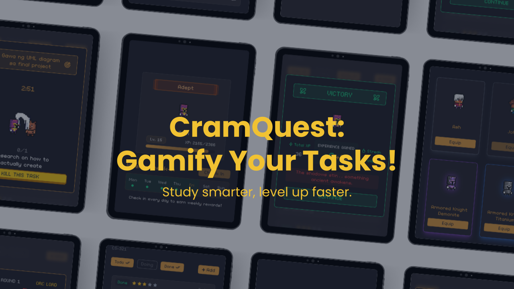
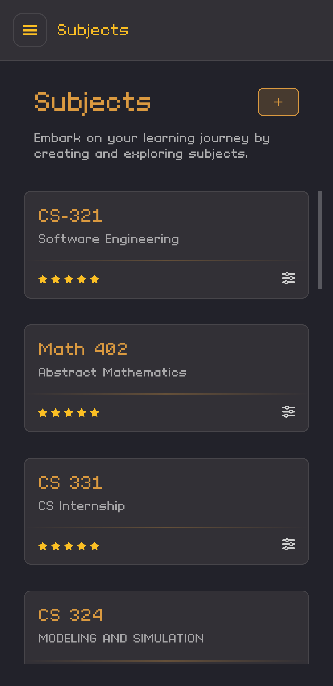
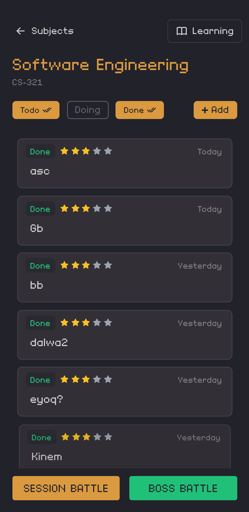
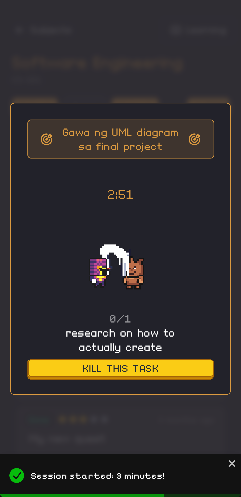
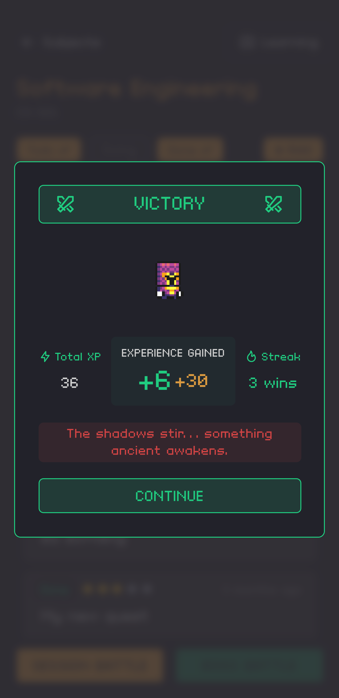
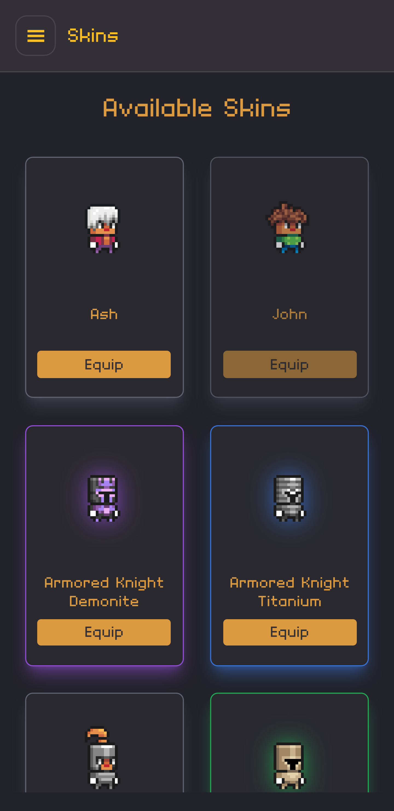

# CramQuest: Gamify your Tasks!

Turn your study sessions into RPG battles. Create subjects, manage quests, fight through your to-do list, and level up your character — all while getting things done.

Now live at [husphil.github.io/cramquest](https://husphil.github.io/cramquest)



## Features

### Subjects & Quests

Organize your study material into subjects and break them down into actionable quests. Each subject has its own set of tasks and learning materials.

| Subjects | Quests |
|:--------:|:------:|
|  |  |

### Battle & Boss Battles

Start a battle session for a subject, set a timer, and work through your quests. Complete enough sessions to face a boss in a turn-based RPG battle.

| Battle Session | Boss Battle |
|:--------------:|:-----------:|
|  |  |

### Rewards & Progression

Earn XP, level up, unlock titles, and collect skins to customize your avatar.

| Rewards | Skins |
|:-------:|:-----:|
|  |  |

## Tech Stack

- **Framework:** React 19 + TypeScript
- **Bundler:** Vite 6
- **Styling:** Tailwind CSS 3
- **State Management:** Zustand 5
- **Server State:** TanStack Query 5
- **Routing:** React Router 7
- **HTTP Client:** Axios
- **Notifications:** React Toastify

## Getting Started

```bash
npm install
npm run dev
```

### Build for production

```bash
npm run build
```

### Environment variables

Create a `.env` file in the project root:

```env
VITE_API_URL=https://your-api-url.com
VITE_API_KEY_HEADER_NAME=your-header-name
VITE_API_KEY=your-api-key
```


